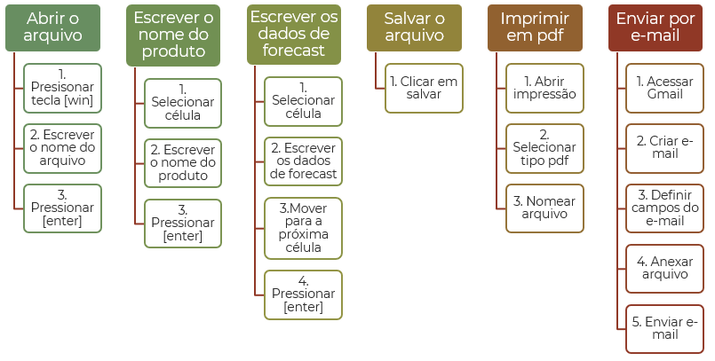

Escrever o fluxo de trabalho
****

Antes de irmos para a parte dos códigos, é muito importante estar definido qual o fluxo de trabalho que este robô/bot irá realizar.

Lembre-se sempre do conceito de *Garbage in - Garbage out*.

Se automatizarmos um processo ineficiente, teremos um processo ruim acontecendo em larga escala e de forma automatizada, o que pode trazer sérios danos para a empresa.

Por isso a otimização do fluxo de trabalho é um passo importantíssimo na hora da criação de um robô de RPA.

Uma sugestão que nós damos é pegar as etapas macro e decupá-las em diversas etapas, onde cada "caixinha" irá virar uma célula de código.

.. note::

      Este fluxo de trabalho que disponibilizamos é apenas um exemplo de um projeto realizado em aula, para diferentes tarefas/projetos serão diferentes fluxos, cada um descrevendo qual a etapa de seu projeto.

Essa etapa é importante para definir em qual etapa o robô irá utilizar o mouse, ou o teclado, e também entender se sua solução irá rodar apenas no seu computador, se irá rodar em outros computadores, etc. Para que seja possível criar um fluxo que atenda a sua realidade.

Dessa forma tendo um fluxo de trabalho bem definido, fica mais otimizado na hora de criar seu código, verificar se o seu robô está executando da maneira correta e em qual etapa está falhando. 
