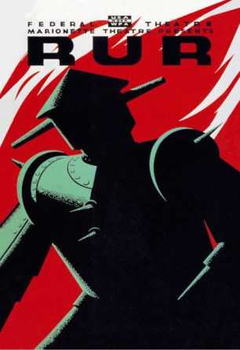
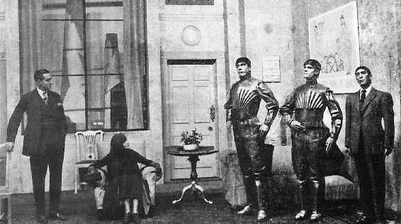
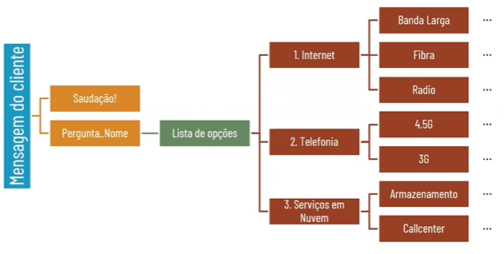
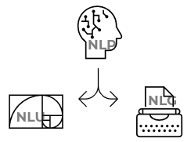
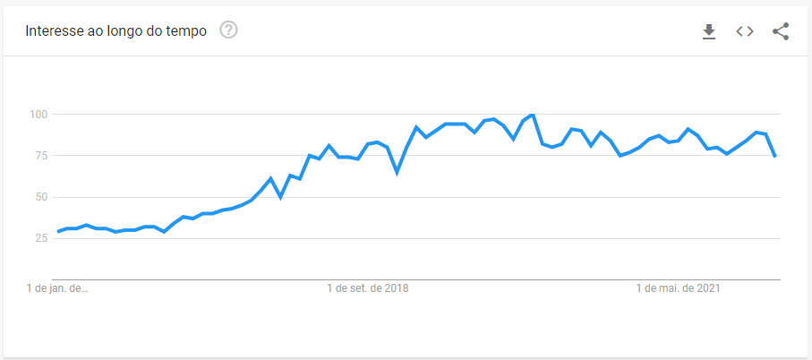
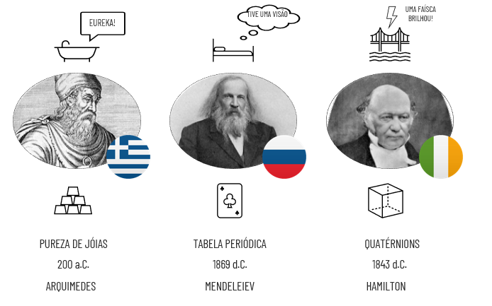

Introdução
****

RPA é uma sigla que significa *Robotic Process Automation*, na tradução seria  **automação de processo robotizada**.

Antes de entrarmos na parte prática da automação, vamos entender alguns conceitos iniciais.

01.O que é um *Robot*
=====

A primeira vez que o termo *Robot* surgiu foi na peça de teatro R.U.R de 1920 do autor Karel Capek.

A sigla R.U.R na tradução seria Robotas Universais de Rossum, a peça consiste em uma fábrica onde se construiam clones (humanóides) que tinha a função de servir os humanos reais.

Daí que surge o termo **Robota**, remetendo ao **trabalho forçado** (repetitivo e pouco produtivo) que os clones eram obrigados a realizar.

Portanto de acordo com a origem da palavra quando falamos em "construir um robô" para determinada atividade, no fundo estamos falando em colocar o computador para executar um trabalho forçado (repetitivo e pouco produtivo) para nós. 

02.O que é RPA
====

Com o passar dos anos a palavra robô ganhou um novo contexto, como por exemplo o robô (feito em python) de hoje em dia tmabém é chamado de BOT.
Hoje quando falamos em RPA na área da tecnologia nos referimos a um conjunto de bots para automatização de processos repetitivos.

Com isso podemos realizar diversas atividades como preenchimento, extração, transformação e carregamento de dados. Geração de relatóriosm criação de dashboards, envio de e-mails, chatbots, posts em redes sociais, mineração e raspagem de dados. 

.. warning::

   Lembre-se sempre do conceito de *Garbage in - Garbage out* 

   .. image:: images/RPA/garbage.png
      :align: center
      :width: 450

   **Cuidado para não automatizar um processo ineficiente!** "Automatizar a burrice" consome recursos (tempo e dinheiro) para implementar, identificar e corrigir as falhas. 

Portanto ao falar em RPA é muito importante primeiro otimizar o processo e depois automatizar, dessa forma o processo custará menos recursos e terá menos falha. 

02.a.RPA de Árvore de decisão
----

Outra possível maneira de utilizar um RPA quando não temos um processo muito bem definido e temos uma atividade com muita interface com o usuário final, o melhor desenho é uma Árvore de decisão pois ele irá trazer uma lista de opções dependendo da escolha do usuário.

Por exemplo no desenho abaixo, uma Árvore de decisão para chatbot de atendimento numa empresa de telecom.

02.b.RPA com NLP-NLU-NLG
----

Uma outra extensão emergente nos últimos anos é o uso de RPA com ferramentas como:

* NLP - Processamento de Linguagem Natural
* NLU - Entendimento de Linguagem Natural
* NLG - Geração de Linguagem Natural

Ou seja, com o uso dessas três ferramentas é possível entender padrões como contexto, sintaxe, estrutura e depois criar um novo texto com base nos padrões entendidos anteriormente.

02.c.Google Trends: RPA 
----

Através da ferramenta Google Treds é possível verificar o constante crescimento de pesquisas feitas procurando o termo RPA ao redor do mundo.

Essa pesquisa foi feita pegando o período de tempo de 2016 até 2022

02.d.Por que RPA?
----

Através de toda a história da humanidade tivemos diversos momentos de genialidade, e muitos deles, mesmo que antigos, rementem aos tempos atuais. 

A maioria das descobertas feitas por inventores ao redor do mundo foram em momentos de relaxamento, que, ao se desligar das tarefas repetitivas do dia a dia e relaxarem puderam deixar a criatividade rolar e resolver seus problemas. 

Como é possível perceber, esses grandes gênios tiveram insights não quando estavam focados no problema, mas sim ao relaxar. 

Por isso, ao automatizar tarefas massantes, repetitivas, nós conseguimos ter mais tempo livre para dedicar a ter um estado mental criativo e disciplinado, de forma a ter insisghts que gerem mais valor ao negócio.
