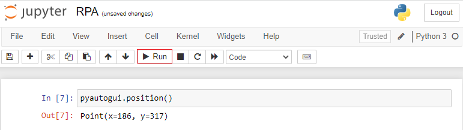

Pyautogui
****

Conhecer várias bibliotecas em Python para editar planilhas, criar aplicativos, gerar gráficos é útil, mas às vezes não existem bibliotecas para os aplicativos com os quais você precisa trabalhar.

As ferramentas definitivas para automatizar tarefas em seu computador são programas que você escreve e que controlam diretamente o teclado e o mouse. 

Esses aplicativos podem controlar outros aplicativos enviando-lhes teclas virtuais e cliques do mouse, como se você estivesse sentado em seu computador e interagindo com os aplicativos por conta própria.

Essa técnica é conhecida como automação de interface gráfica do usuário ou *GUI automação*, para abreviar.

Para trabalhar controlando os cliques do mouse e do teclado em Python nós temos uma biblioteca chamada **PyAutoGui**. Ela possui seu nome pois: 

* Py = Python

* Auto = Automatização

* GUI = Graphical User Interface (interface gráfica do usuário) .

Portanto a biblioteca Pyautogui é uma biblioteca da linguagem Python para automatizar tarefas que utilizam a interface gráfica do usuário.

Caso queira ler mais sobre existe a documentação original: https://pyautogui.readthedocs.io/en/latest/

01.Comandos da Pyautogui
====

01.a.Tempos de espera
----

É possível estabelecer alguns tempos de espera para o computador na hora de automatizar as tarefas. Esse tempo de espera é importante para o computador não se atropelar em termos de processamento, esperar uma janela abrir, conseguir acompanhar visualmente o que seu programa está executando.

Para isso temos as seguintes maneiras:

01.a.I.Comando ``PAUSE``
+++++

o Comando ``PAUSE`` vem da biblioteca pyautogui e estabelece um tempo de espera entre operações. Para executá-lo fazemos da seguinte maneira:

.. code-block:: python
   :linenos:
   
   import pyautogui
   pyautogui.PAUSE = 0.5 
   
Neste exemplo estamos definindo um tempo de espera de meio segundo, mas ele pode variar para mais ou para menos, depende da aplicação de seu programa.   

01.a.II.Comando ``sleep``
++++

Ele é outra forma de definir um tempo de espera entre operações, porém de uma biblioteca chamada time, muito conhecida também. Para executá-lo fazemos da seguinte maneira:

.. code-block:: python
   :linenos:
   
   import time
   time.sleep(0.5)

Neste exemplo estamos estabelecendo um tempo de espera de meio segundo, esse número pode variar para mais ou para menos, depende da aplicação de seu programa.

01.b.Descobrir o tamanho da tela
----

Como a biblioteca Pyautogui trabalha com a interface gráfica do computador, as vezes nos deparamos em uma situação onde precisamos saber o tamanho da tela para realizar determinada aplicação. Para isso temos o comando ``size()`` que nos informa qual a resolução da tela em altura (y) e largura (x).

Para executá-lo fazemos da seguinte maneira:

.. code-block:: python
   :linenos:

    import pyautogui
    pyautogui.size()
    
O output (saída) deste código é o tamanho da nossa tela, em altura e largura.

01.c.Utilizando o teclado
----

01.c.I.Pressionar uma tecla
++++

Ao automatizar tarefas é fundamental conseguir enviar cliques virtuais de teclas do teclado. Para isso temos o comando ``press('tecla')`` que imita o clique na tecla indicada como se fosse uma pessoa executando. 

Para executá-lo fazemos da seguinte maneira:

.. code-block:: python
   :linenos:

   import pyautogui
   pyautogui.press('A')
   
No código acima estamos realizando o click da tecla 'A', mas poderia ser diversas outras opções, como o 'Delete', ou o 'CapsLock', tudo depende da tarefa que seu computador está executando.

01.c.II.Pressionar duas ou mais teclas simultaneamente
++++

É normal no dia a dia mexendo em um computador se deperar com comandos chamados de *hotkeys* que são nada mais que atalhos para tarefas do dia a dia, como por exemplo o copiar ("ctrl + c") e colar ("ctrl + v"). Para isso na biblioteca Pyautogui temos o comando  ``hotkey('tecla_1','tecla_2')``, basta substituir pelas teclas desejadas. 

.. code-block:: python
   :linenos:

   import pyautogui
   pyautogui.hotkey('ctrl','c')

01.c.III.Escrever texto
++++

Ao automatizar tarefas é muito importante conseguir preencher "textos", seja para realizar o login em algum site, escrever um e-mail, digitar um site, etc. Para isso temos o comando ``write()`` que nos permite a escrita de texto.

Para executá-lo fazemos da seguinte maneira:

.. code-block:: python
   :linenos:

   import pyautogui
   pyautogui.write('texto desejado aqui')

No exemplo acima estamos indicando para que seja escrito 'texto desejado aqui', porém isso irá variar dependendo da aplicação de seu código.

01.d.Trabalhando com o mouse
----

01.d.I.Descobrir a posição do mouse na tela
++++

A interface gráfica da tela trabalha como um gráfico, com os eixos y (altura) e x (largura). Ao escrever programas de automação utilizando a biblioteca Pyautogui é muito importante descobrir qual a posição que seu mouse se encontra na hora de fechar uma janela, clicar em um ícone, enviar uma mensagem, etc.

Para isso temos o comando ``position()`` que informa a posição do mouse na tela. Para executá-lo fazemos da seguinte maneira:

.. code-block:: python
   :linenos:
   
   import pyautogui
   pyautogui.position()
   
O output (saída) deste comando será justamente a posição do ponto que seu mouse se encontra, podendo variar, dependendo da localização. Lembrando que a posição do mouse varia para diferentes tamanhos de tela.

01.d.II.Mover o cursor do mouse
++++

Uma vez com as posições do mouse descobertas com o comando ``position()`` é preciso conseguir mover o cursor do mouse para elas. Para isso temos o comando ``moveTo(x,y)``, onde será substituído no lugar de x e y os valores descobertos anteriormente.

Para executá-lo fazemos da seguinte maneira:

.. code-block:: python
   :linenos:

   import pyautogui
   pyautogui.moveTo(428,247)

No exemplo acima estabelecemos que é para mover o cursos do mouse para a posição 428(x),247(x) porém essa posição pode variar dependendo da sua aplicação, tamanho da tela, etc.

01.d.III. Executar um click com o Mouse
++++

Praticamente qualquer aplicação que desejamos fazer no computador é necessário que se tenha o click do botão esquerdo do mouse. 

Porém sempre ao automatizar tarefas, busque maneiras de como realizá-las utilizando apenas o teclado. Assim você não fica tão dependente da posição do mouse na tela e de toda vez que trocar de tamanho de tela atualizar seu código, dessa forma, criando um código mais genérico e independente.

Mas caso o click do botão esquerdo do mouse seja essencial para sua tarefa, existe o comando ``click()``. 
Portanto ao unir o comando ``.moveTo()`` com o ``click()`` podemos mover o cursor do mouse para a localização desejada e realizar o clique do mouse.
Para executá-lo fazemos da seguinte maneira:

.. code-block:: python
   :linenos:

   import pyautogui
   pyautogui.click()

